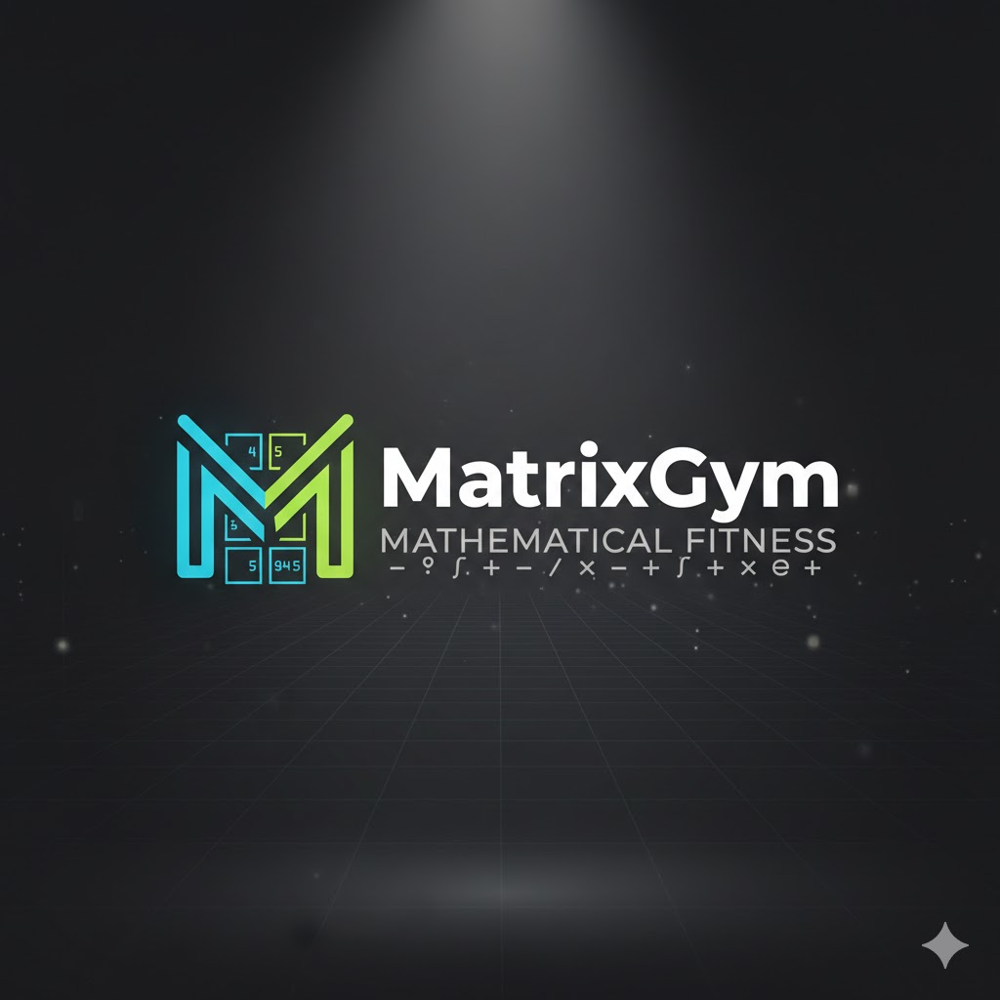

# MatrixGym

A personal exploration into the intersection of mathematics and focus.

This project started from a simple curiosity: can we use the tools we learn at university to build something that actually helps us practice and grow? MatrixGym is my attempt to answer that question through analytical geometry exercises powered by matrix transformations.

I believe that practice sharpens focus, and focus is one of life's most valuable skills. By working through spatial reasoning problems and algebraic operations, we're not just doing math—we're training our minds to concentrate, persist, and think clearly.

Built with AWS SAM as a serverless web application, this platform generates geometry exercises using modular filters like Sahhaus, Laplace, and other determinant theories. It's lightweight by design, bridging abstract mathematical concepts with geometric intuition through hands-on practice.

## Live Demo

🚀 **Try MatrixGym**: https://gym.dataiesb.com

Practice 3x3 matrix determinant calculations with step-by-step mathematical demonstrations using the Sarrus rule (diagonal method).
